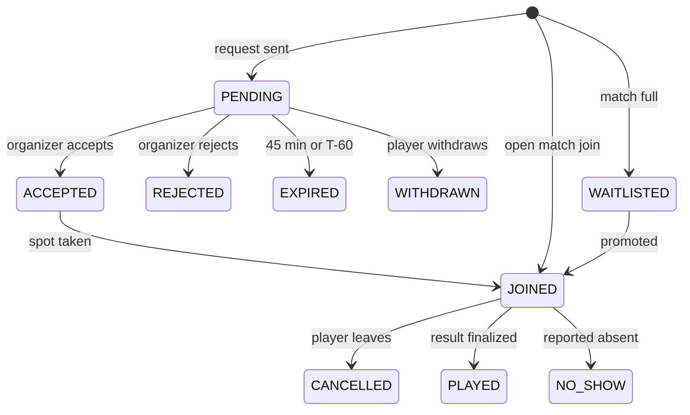
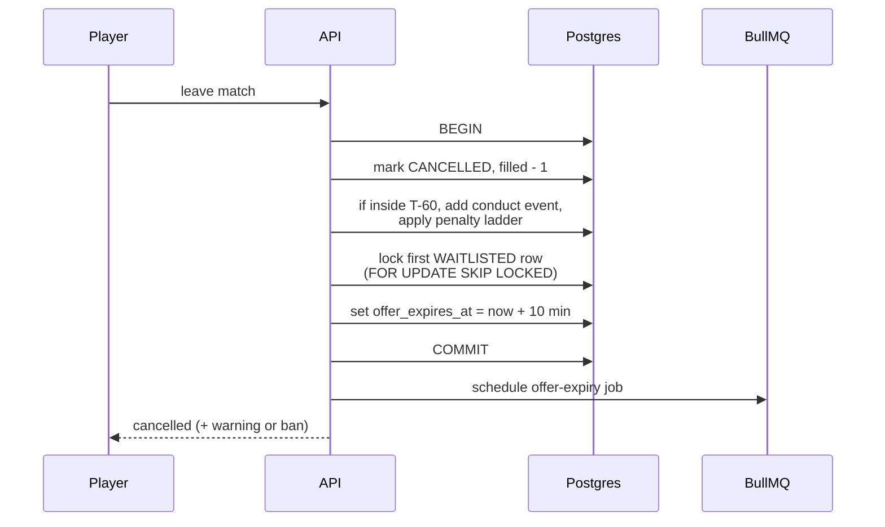
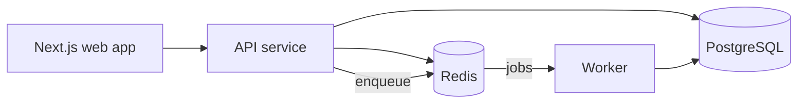

# PickupFooty — Design Doc

2026-09-17 · @Someone

## Overview and goals

A web app for football players in Jaipur to create and join local matches, with skill ratings that update from real results and penalties for unreliable players. The MVP ships in 4 weeks and is built as a backend showcase: correct data under concurrency, time-based rules, and a clean relational schema.

**Users**

- **Player:** creates a profile, finds matches, joins or requests to join, plays, rates others, climbs the leaderboard.
- **Organizer:** any player who creates a match. Picks format, venue and time, approves requests, submits the result.
- **Admin:** manages venues and pitches, reviews disputes and reports.

**Goals**

1. A match never has more players than spots, even when many people join at the same second.
2. A pitch is never double-booked, and a player is never in two overlapping matches.
3. Time rules (join cutoff, request expiry, late-cancel penalty) are enforced by the server, never trusted from the client.
4. Every rating change is explainable from an append-only history.
5. Deployed with Docker, CI, tests and a published load-test result.

## Scope

The MVP is ten features; everything else waits until the MVP is deployed and on the resume.

| Feature | Release | Main backend concept |
| --- | --- | --- |
| Accounts and profiles | MVP | Auth, JWT, RBAC |
| Formats, venues, pitches | MVP | Reference data, seed scripts |
| Match creation with clash check | MVP | Exclusion constraint on time ranges |
| Join (open) and request to join (approval) | MVP | Atomic capacity update |
| Request auto-expiry (45 min) | MVP | Delayed jobs + DB as source of truth |
| Waitlist with promotion | MVP | Queue ordering inside a transaction |
| Late-cancel warnings, demerits, bans | MVP | Time-window rules, history tables |
| Pitch view with positions | MVP | Unique slot per team |
| Results, dispute window, ratings | MVP | Exactly-once updates, audit log |
| Weekly leaderboard | MVP | Window functions, Redis sorted set |
| Team auto-balancing | Phase 2 | Partition algorithm |
| Tournaments | Phase 2 | Fixture generation, points table view |
| Nearby match search | Phase 2 | Geo index |
| AI stat entry from free text | Phase 2 | LLM output validated against roster |
| Notifications (email / WhatsApp) | Phase 2 | Outbox pattern |

**Non-goals:** payments, a mobile app, real turf-owner integrations, chat, and multi-city support.

## Core rules and match timeline

All times are relative to kickoff (T), computed from server time, stored as `timestamptz` and shown in IST.

| Window | Joining | Requests | Waitlist | Player cancels |
| --- | --- | --- | --- | --- |
| Creation to T-90 | Open | Accepted, expire after 45 min | Open | Free |
| T-90 to T-60 | Closed | Closed | Still promotes | Free |
| T-60 to T-30 | Closed | Closed | Still promotes | Penalty |
| T-30 to T | Closed | Closed | Frozen | Penalty |
| After T, no show | — | — | — | Demerit directly |

**Request expiry.** `expires_at = LEAST(requested_at + 45 min, starts_at - 60 min)`, so a player is never accepted into a slot they can no longer leave freely.

**Waitlist.** When a spot opens before T-30, the first waitlisted player gets 10 minutes to confirm, then the offer passes to the next.

**Penalty ladder** (counted over the last 30 days):

1. First late cancel: warning.
2. Second late cancel: 1 demerit point.
3. Third late cancel, or 2 active demerit points: 7-day ban from joining or creating matches.

**Fairness rules**

- Demerit points expire after 30 days.
- An organizer who cancels late is penalized the same way, unless they mark the reason as weather or venue closure (tracked for abuse).
- A no-show reported by at least 2 players who were in the match gives 1 demerit point.
- A player can't hold overlapping matches; accepting one request withdraws their other pending requests for overlapping times.



Requests (`PENDING` to `EXPIRED`) live in `join_requests`; participation (`WAITLISTED` to `NO_SHOW`) lives in `match_players`. Only `JOINED` holds a spot.

## Feature specs

Each MVP feature lists what the user sees and the backend rules behind it.

### 1. Accounts and profiles

- Sign up with name, phone or email, password; login returns a short-lived access JWT and a refresh token stored in Redis.
- Profile: display name, photo, preferred position (GK, DEF, MID, FWD), preferred foot, area of Jaipur.
- Skill level at sign-up: Beginner, Casual, Intermediate or Competitive, mapped to a starting rating of 1000, 1150, 1300 or 1450.
- Public profile shows rating, matches played, goals, assists, reliability score and recent form.
- Roles: `PLAYER` and `ADMIN`; organizer rights are per match, checked by `host_id`.

### 2. Formats, venues and pitches

- Formats are seeded: 5v5, 7v7, 11v11. Custom allows 4 to 11 players per side.
- A venue has one or more pitches; each pitch has a maximum format size and surface type.
- Admins manage venues; players can suggest one for approval.

### 3. Create a match

Flow: pick format, pick venue, pick time, set join mode and options, create.

- Only pitches that fit the format are listed; only free time slots on that pitch are offered.
- Options: join mode (`OPEN` or `APPROVAL`), duration, substitutes (0 to 3 per side), optional rating range, description.
- Capacity = 2 × players per side + substitutes. The organizer takes a spot automatically.
- A Postgres exclusion constraint rejects overlapping matches on the same pitch, even if two organizers submit at once.
- Matches must start at least 2 hours and at most 14 days from now.
- Assumption: the organizer books the turf offline; the app only prevents clashes between matches created here.

### 4. Join or request to join

- Open matches: joining takes a spot instantly if one is free, else offers the waitlist.
- Approval matches: the player sends a request with an optional note; the organizer accepts or rejects.
- Joining is blocked if the player is banned, already in an overlapping match, or outside the rating range.
- Requests expire automatically per the timeline rules; the player is notified.
- Accepting a request and taking the spot happen in one transaction; if the match filled meanwhile, the accept fails and the player is waitlisted.

### 5. Waitlist

- Ordered by join time. A freed spot is offered to the first player for 10 minutes.
- Promotion happens in the same transaction as the cancellation that freed the spot.
- Frozen from T-30.

### 6. Cancellation, demerits and bans

- Players can leave a match; organizers can cancel it with a reason.
- The penalty ladder and fairness rules above are applied in the cancel transaction.
- Players see their warnings, active demerits and ban end date on their profile.
- Bans are rows with start and end times, never a boolean flag.

### 7. Pitch view

- An SVG pitch shows both teams in the match's formation, with each player's photo, name and rating in their slot.
- Formations are data: each slot has a role and x/y position (0 to 100). Team B is mirrored.
- In open matches, a player can tap an empty slot to join in that position; two players can't take the same slot.
- The organizer can drag players between slots or teams until kickoff.
- Custom sizes without a template use an auto-spaced layout.

### 8. Results and disputes

- After the match, the organizer submits the score and each player's goals, assists and clean sheet, and marks no-shows.
- Goals per team must add up to the score, or the submission is rejected.
- Players have 24 hours to dispute; a dispute freezes the result until an admin or the organizer resolves it.
- With no dispute, the result is finalized automatically after 24 hours.
- Within 48 hours of the match, each player can rate others from 1 to 5 and report lateness.

### 9. Ratings

Ratings update once, when the result is finalized.

- **Team result (Elo):** expected score from the average team ratings; K = 40 for a player's first 10 matches (provisional), then K = 20. Goal difference adds a multiplier capped at 1.5.
- **Individual bonus:** up to +5 per match from goals, assists and clean sheets.
- **Peer adjustment:** up to ±5 from peer ratings, ignoring the highest and lowest score, and only once at least 3 ratings exist.
- Every change is written to `rating_history` with the old value, new value and a breakdown.

### 10. Weekly leaderboard

- Snapshot every Monday 00:00 IST: rank, rating and change since last week.
- Filters: overall, by position, by area.
- Minimum 3 matches in the last 30 days to appear.
- Live ranks come from a Redis sorted set; Postgres is the source of truth and can rebuild it.
- Also shows top scorers and most reliable players of the week.

## Data model

PostgreSQL 16 is the single source of truth; the database itself enforces capacity limits, clashes and uniqueness. Requires the `btree_gist` extension.

```sql
-- People
users(id, name, email UNIQUE, phone UNIQUE, password_hash, role, area,
      preferred_position, preferred_foot, created_at)
player_ratings(user_id PK FK, rating, matches_played, is_provisional, updated_at)
rating_history(id, user_id FK, match_id FK, old_rating, new_rating,
               breakdown JSONB, created_at)             -- append-only

-- Places
formats(id, name, players_per_side, default_duration_min)
venues(id, name, address, lat, lng, status)
pitches(id, venue_id FK, name, max_players_per_side, surface)
formation_templates(id, players_per_side, name)
formation_slots(template_id FK, slot_code, role, x, y,
                PRIMARY KEY (template_id, slot_code))

-- Matches
matches(id, host_id FK, pitch_id FK, format_id FK NULL, formation_id FK NULL,
        players_per_side, subs_per_side, capacity, filled,
        join_mode, min_rating, max_rating, status,
        during TSTZRANGE NOT NULL, version, created_at,
        CHECK (filled <= capacity),
        EXCLUDE USING gist (pitch_id WITH =, during WITH &&)
          WHERE (status <> 'CANCELLED'))

match_players(match_id FK, user_id FK, team, slot_code, status,
              during TSTZRANGE, waitlist_position, offer_expires_at, joined_at,
              PRIMARY KEY (match_id, user_id),
              EXCLUDE USING gist (user_id WITH =, during WITH &&)
                WHERE (status = 'JOINED'))
-- partial unique index: one player per slot per team
CREATE UNIQUE INDEX ON match_players (match_id, team, slot_code)
  WHERE status = 'JOINED' AND slot_code IS NOT NULL;

join_requests(id, match_id FK, user_id FK, note, status,
              requested_at, expires_at, decided_at)
CREATE UNIQUE INDEX ON join_requests (match_id, user_id)
  WHERE status = 'PENDING';

-- Results
match_results(match_id PK FK, score_a, score_b, submitted_by, submitted_at,
              dispute_deadline, status, finalized_at, ratings_applied_at)
player_match_stats(match_id FK, user_id FK, goals, assists, clean_sheet,
                   PRIMARY KEY (match_id, user_id))
disputes(id, match_id FK, raised_by FK, reason, status, resolved_by, resolved_at)
peer_ratings(match_id FK, rater_id FK, ratee_id FK, score, created_at,
             PRIMARY KEY (match_id, rater_id, ratee_id), CHECK (rater_id <> ratee_id))

-- Discipline
conduct_events(id, user_id FK, match_id FK, type, created_at)  -- LATE_CANCEL, NO_SHOW, LATE_ARRIVAL
demerits(id, user_id FK, conduct_event_id FK, points, expires_at)
bans(id, user_id FK, starts_at, ends_at, reason)

-- Leaderboard
weekly_standings(week_start, user_id FK, rating, rank, rank_change,
                 PRIMARY KEY (week_start, user_id))
```

**Design notes**

- `during` is copied onto `match_players` so Postgres can block a player from overlapping matches. The copy is set in the join transaction and never edited.
- `filled` is a counter kept next to `capacity` so a join is one conditional update instead of a `COUNT(*)` under a lock.
- `rating_history` is never updated or deleted; ratings can be rebuilt from it if the formula changes.
- Time is never stored as local time; all timestamps are `timestamptz`.

**Indexes**

| Index | Serves |
| --- | --- |
| `matches (status, lower(during))` | Upcoming open matches list |
| `match_players (user_id, status)` | My matches |
| `join_requests (match_id) WHERE status = 'PENDING'` | Organizer's pending queue |
| `conduct_events (user_id, created_at)` | Penalty ladder lookback |
| `bans (user_id, ends_at)` | Active ban check on join |
| `player_ratings (rating DESC)` | Leaderboard rebuild |

## Key flows and concurrency

Every flow that changes a spot, a slot or a rating is a single transaction with a conditional update, so correctness never depends on application-level checks.

### Join an open match

```sql
BEGIN;
-- 1. take a spot only if one is free
UPDATE matches SET filled = filled + 1, version = version + 1
WHERE id = $match AND filled < capacity AND status = 'OPEN'
  AND lower(during) > now() + interval '90 minutes'
RETURNING during;
-- 0 rows -> match full or closed: insert as WAITLISTED instead

-- 2. add the player; exclusion constraint rejects overlapping matches,
--    unique index rejects a taken slot
INSERT INTO match_players (match_id, user_id, team, slot_code, status, during)
VALUES ($match, $user, $team, $slot, 'JOINED', $during);
COMMIT;
```

Before step 1, the service checks for an active ban and the rating range. A constraint violation in step 2 rolls back step 1, so `filled` stays correct.

### Accept a request

```sql
BEGIN;
UPDATE join_requests SET status = 'ACCEPTED', decided_at = now()
WHERE id = $req AND status = 'PENDING' AND expires_at > now()
RETURNING user_id;             -- 0 rows -> already expired or decided
-- then the same two steps as an open join
-- then withdraw the player's other PENDING requests that overlap in time
COMMIT;
```

### Cancel and promote



The waitlisted player confirms within 10 minutes to take the spot, using the join steps above with the cutoff moved from T-90 to T-30; otherwise the expiry job offers it to the next player.

### Finalize result and update ratings

```sql
BEGIN;
UPDATE match_results SET status = 'FINALIZED', finalized_at = now()
WHERE match_id = $m AND status = 'SUBMITTED' AND dispute_deadline < now()
RETURNING match_id;            -- 0 rows -> disputed or already done
-- compute new ratings for all players, insert rating_history rows,
-- update player_ratings, set ratings_applied_at = now()
COMMIT;
```

The conditional status change makes this safe to retry: a second run finds no row and does nothing.

### Concurrency decisions

| Situation | Approach | Why |
| --- | --- | --- |
| Last spot in a match | Atomic conditional `UPDATE` | One statement, no explicit lock |
| Two matches on one pitch | Exclusion constraint | Correct even if app code is buggy |
| Player in two matches | Exclusion constraint on copied `during` | Same |
| Same pitch slot | Partial unique index | Same |
| Organizer edits vs player joins | Optimistic `version` column | Edits are rare; retry on conflict |
| Waitlist promotion | `FOR UPDATE SKIP LOCKED` | Two cancels never promote the same player |
| Rating update | Status guard in the same transaction | Exactly-once under retries |

## Background jobs

Jobs send notifications and move state forward on time, but every query also checks timestamps, so a late or lost job never produces wrong data.

| Job | Trigger | What it does | Idempotency |
| --- | --- | --- | --- |
| Expire request | Delayed, at `expires_at` | `PENDING` to `EXPIRED`, notify player | Job id = request id; status guard |
| Waitlist offer expiry | Delayed, 10 min after offer | Offer spot to next waitlisted player | Job id = match id + user id |
| Match reminder | Delayed, at T-120 | Remind players; last free cancel is at T-60 | Job id = match id |
| Close match | Delayed, at T | Status `OPEN` to `IN_PROGRESS` | Status guard |
| Finalize result | Delayed, at dispute deadline | Run finalize-and-rate flow | Status guard |
| Expire demerits and bans | Repeatable, hourly | Mark expired rows; refresh reliability score | Safe to re-run |
| Weekly standings | Repeatable, Monday 00:00 IST | Snapshot ranks into `weekly_standings`, rebuild Redis leaderboard | Primary key on week + user |
| Sweeper | Repeatable, every 5 min | Catch anything a delayed job missed | Same guards |

- Queue: BullMQ on Redis, with 5 retries and exponential backoff, then a failed-jobs list shown on an admin page.
- Jobs are enqueued after the transaction commits, so a rolled-back change never schedules a job.

## API

REST over JSON under `/api/v1`, with request bodies validated by Zod and errors returned as `{ code, message }`.

| Method | Path | Purpose | Auth |
| --- | --- | --- | --- |
| POST | `/auth/signup`, `/auth/login`, `/auth/refresh` | Accounts and tokens | Public |
| GET, PATCH | `/me` | Own profile, warnings, bans | Player |
| GET | `/players/:id` | Public profile and stats | Player |
| GET | `/venues`, `/venues/:id/pitches` | Venues and pitches | Player |
| GET | `/pitches/:id/availability?date=` | Free time slots | Player |
| POST | `/matches` | Create a match | Player |
| GET | `/matches?date=&format=&area=&cursor=` | List upcoming matches (keyset pagination) | Player |
| GET, PATCH, DELETE | `/matches/:id` | View, edit, cancel | Host for edits |
| POST | `/matches/:id/join` | Join an open match or the waitlist | Player |
| POST | `/matches/:id/leave` | Leave; returns any penalty applied | Player |
| POST | `/matches/:id/requests` | Request to join | Player |
| GET | `/matches/:id/requests` | Pending requests | Host |
| POST | `/requests/:id/accept`, `/requests/:id/reject` | Decide a request | Host |
| POST | `/matches/:id/waitlist/confirm` | Accept a waitlist offer | Offered player |
| PUT | `/matches/:id/lineup` | Move players between slots and teams | Host |
| POST | `/matches/:id/result` | Submit score and stats | Host |
| POST | `/matches/:id/disputes` | Dispute the result | Participant |
| POST | `/matches/:id/ratings` | Rate other players | Participant |
| GET | `/leaderboard?week=&position=&area=` | Weekly standings | Player |
| GET | `/players/:id/rating-history` | Rating changes with breakdown | Player |
| PATCH | `/admin/disputes/:id`, `/admin/venues/:id` | Moderation | Admin |

- Join, leave, accept and result endpoints accept an `Idempotency-Key` header; a repeated key returns the first response.
- Rate limits per user in Redis: 30 writes per minute, 5 login attempts per 15 minutes.

## Tech stack and architecture

One API service, one worker process, Postgres and Redis, all run with Docker Compose; no microservices.

| Layer | Choice | Reason |
| --- | --- | --- |
| API | Node.js, TypeScript, Express | Matches existing experience |
| Queries | Raw SQL through Kysely, migrations with its migrator | Locks and constraints stay visible |
| Validation | Zod | Shared request and response types |
| Database | PostgreSQL 16 with `btree_gist` | Range types and exclusion constraints |
| Cache and queue | Redis 7, BullMQ | Sessions, rate limits, leaderboard, jobs |
| Frontend | Next.js, Tailwind | Plain and functional; SVG pitch view |
| Tests | Vitest, Supertest, Testcontainers | Real Postgres in tests |
| Load test | k6 | Concurrency proof |
| CI/CD | GitHub Actions | Lint, test, build image |
| Hosting | Render or Railway (API, worker), Neon or Supabase (Postgres), Upstash (Redis) | Free tiers |
| Observability | Pino logs, request ids, `/health` endpoint | Enough to debug |



The API and worker share one codebase and differ only in their start command.

**Folder layout**

```text
src/
  modules/        auth, players, venues, matches, requests,
                  results, ratings, discipline, leaderboard
    <module>/     routes.ts, service.ts, repo.ts, schema.ts
  jobs/           one file per job
  db/             migrations/, seeds/
  lib/            db, redis, queue, errors, time
tests/
  integration/
  concurrency/
load/             k6 scripts
```

## Testing and load testing

The concurrency tests are the project's headline result; their numbers go in the README and on the resume.

**Concurrency tests (against real Postgres)**

| Test | Setup | Pass condition |
| --- | --- | --- |
| Last spot | 1 spot left, 200 simultaneous joins | Exactly 1 joined, `filled = capacity` |
| Pitch clash | 50 simultaneous creates for overlapping times | Exactly 1 match created |
| Player overlap | 1 player joins 2 overlapping matches at once | Exactly 1 succeeds |
| Slot race | 20 players tap the same slot | Exactly 1 in the slot |
| Accept vs expiry | Accept fired at `expires_at` | Request ends in one state only |
| Double promotion | 2 cancels at once, 1 waitlisted player | Player offered once |
| Rating retry | Finalize job run 5 times | 1 set of `rating_history` rows |

**Other tests**

- Unit: rating formula, penalty ladder, expiry time calculation, timeline windows (with a fake clock).
- Integration: every endpoint's happy path and main error codes.

**Load test (k6)**

- Seed: 10,000 players, 200 venues, 100,000 matches.
- Scenarios: browse matches, join rush on one match, leaderboard reads.
- Record p50 and p95 latency, requests per second, and error rate.
- Run `EXPLAIN ANALYZE` on the 5 slowest queries; record timings before and after indexes.

## Milestones

The MVP is deployed by Sunday 18 October 2026, assuming work starts Monday 21 September; the resume is updated that week.

**Week 1 (21–27 Sep): foundation**

- [ ] Repo, Docker Compose, CI pipeline, migrations
- [ ] Auth, profiles, roles
- [ ] Formats, venues, pitches, formation templates with seed data
- [ ] Create match with the pitch clash constraint, list matches

**Week 2 (28 Sep–4 Oct): joining**

- [ ] Open join with capacity and player overlap constraints
- [ ] Request to join, accept and reject, auto-expiry job
- [ ] Waitlist with offers and promotion
- [ ] Leave, penalty ladder, demerits, bans
- [ ] Concurrency tests for all of the above

**Week 3 (5–11 Oct): playing**

- [ ] Pitch view and lineup editing
- [ ] Result submission, disputes, auto-finalize
- [ ] Rating engine with history
- [ ] Peer ratings and no-show reports

**Week 4 (12–18 Oct): ship**

- [ ] Weekly leaderboard with Redis
- [ ] Frontend polish on the main flows
- [ ] Deploy, seed demo data, k6 load test, index tuning
- [ ] README with architecture diagram, test results and demo video
- [ ] Update resume; share with local football groups

## Future work and open questions

Phase 2 starts only after the MVP is live.

**Phase 2**

- **Team auto-balancing:** split players into two teams with the smallest rating gap and one goalkeeper each; brute force works up to 7v7 (3,432 splits), a greedy approach beyond that.
- **Tournaments:** round-robin fixtures by the circle method, knockout brackets, points table as a SQL view.
- **Nearby search:** matches within a chosen distance using PostGIS or `earthdistance` with a geo index.
- **AI stat entry:** the organizer types the result in plain language; an LLM returns JSON that the backend checks against the roster and score before showing a confirmation screen.
- **Notifications:** email or WhatsApp through an outbox table so messages are never lost or sent twice.

**How it would scale (discussion only)**

- Read replicas for match lists and profiles.
- Cache the upcoming-matches list in Redis with short expiry.
- Partition `match_players` and `rating_history` by month.

**Open questions**

- [ ] Does a late cancel apply the warning, demerit and ban one step at a time, or all at once?
- [ ] Should waitlist promotion stop at T-30, or run until kickoff?
- [ ] Can a banned player still finish matches they joined before the ban?
- [ ] Who resolves disputes when the organizer is involved: an admin, or a player vote?
